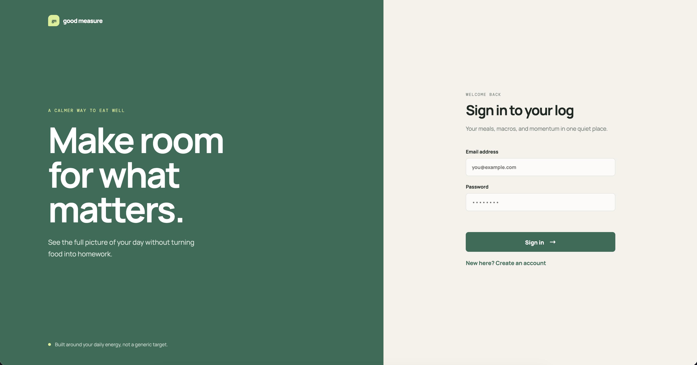
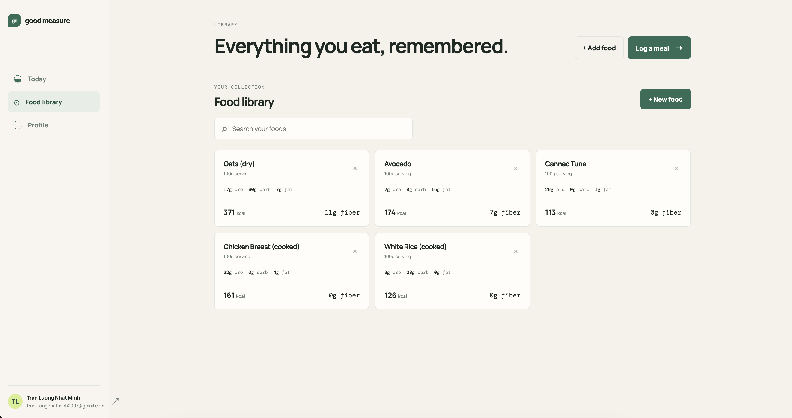
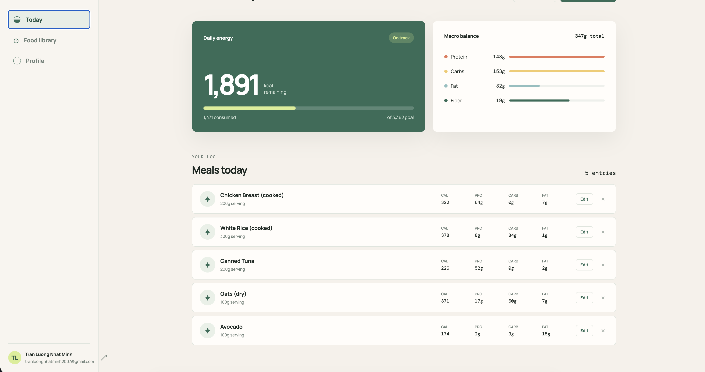

# Calories Tracker

A full-stack nutrition tracking application designed to help users track their daily meals, calories, and macronutrients to support goals such as weight loss, muscle building, and body recomposition.

**Live Demo:** https://calories-tracker-79of.onrender.com

---

## Screenshots

### Dashboard



### Food Management



### Daily Entries



---

## Features

* 🔐 User authentication with JWT
* 🔒 Secure password hashing with bcrypt
* 🍗 Food management
* 📝 Daily food entry tracking
* ⚖️ Food quantity tracking
* 🔢 Automatic calorie calculation  
* 💪 Protein, carbohydrate, and fat tracking
* 🌾 Dietary fiber tracking
* 📊 Daily nutritional totals
* 👤 User-specific data
* 🛡️ Authentication and validation middleware
* ✅ Input validation
* 🗄️ PostgreSQL database
* 🐳 Multi-stage Docker deployment

---

## Tech Stack

### Frontend

* HTML
* CSS
* JavaScript

### Backend

* Node.js
* TypeScript
* Express.js
* Prisma ORM
* PostgreSQL

### Authentication & Security

* JSON Web Tokens (JWT)
* bcrypt

### Testing

* Vitest
* Supertest

### Database

* Supabase PostgreSQL

### Deployment

* Docker
* Render

---

## Architecture

The Express server handles both the REST API and the frontend static files.

### Application Architecture

```text
                    ┌─────────────────────┐
                    │      Frontend       │
                    │   HTML / CSS / JS   │
                    └──────────┬──────────┘
                               │
                               ▼
                    ┌─────────────────────┐
                    │    Express Server   │
                    │     TypeScript      │
                    └──────────┬──────────┘
                               │
                 ┌─────────────┼─────────────┐
                 ▼             ▼             ▼
             User API       Food API      Entry API
                 │             │             │
                 └─────────────┼─────────────┘
                               ▼
                    ┌─────────────────────┐
                    │       Prisma        │
                    └──────────┬──────────┘
                               ▼
                    ┌─────────────────────┐
                    │ Supabase PostgreSQL │
                    └─────────────────────┘
```

### Backend Structure

The backend follows a layered structure that separates responsibilities:

* **Routes** — define API endpoints and connect requests to controllers
* **Middleware** — handles authentication and request validation
* **Controllers** — handle HTTP requests and responses
* **Services** — contain the application's business logic
* **Lib** — contains shared configuration and utilities, such as the Prisma client
* **Prisma** — handles database access

The main API routes are:

```text
/user
/food
/entry
```

The main database models are:

```text
User
Food
Entry
```

---

## Authentication

The application uses JWT-based authentication.

After successful authentication, the server provides a JWT that is required to access protected endpoints. Authentication middleware verifies the token before allowing access to protected resources.

JWTs are configured with a **2-hour expiration time**, limiting the lifetime of compromised tokens.

User passwords are securely hashed using **bcrypt** before being stored in the database. Plaintext passwords are never stored.

Input validation is also applied to ensure invalid data is rejected before reaching the application's business logic or database.

---

## Testing

The project uses:

* **Vitest** for test execution and assertions
* **Supertest** for testing HTTP endpoints

Tests cover:

* API behavior
* Input validation
* Authentication
* Expected HTTP responses
* Different request and response scenarios

Test fixtures are created during testing to simulate realistic users, foods, and food entries without relying on real user data.

---

## Docker

The application is containerized using a **multi-stage Docker build**.

The Docker setup separates the build environment from the production environment, reducing unnecessary files and development dependencies in the final image.

A particular challenge was handling **Prisma 7's custom generated client output**. Because Prisma Client is generated into a custom location, the generated files need to be explicitly included in the final production image.

The Docker configuration was therefore adjusted to ensure the generated Prisma Client is available when the production container starts.

---

## Running Locally

### 1. Clone the repository

```bash
git clone https://github.com/YOUR_USERNAME/Calories-Tracker.git
cd Calories-Tracker
```

### 2. Install dependencies

```bash
npm install
```

### 3. Configure environment variables

Create a `.env` file with the required configuration.

```env
DATABASE_URL="your-database-url"
DIRECT_URL="your-direct-url"
JWT_SECRET="your-secret"
```

### 4. Generate Prisma Client

```bash
npx prisma generate
```

### 5. Start the development server

```bash
npm run dev
```

The application should then be available at:

```text
http://localhost:3000
```

---

## Running with Docker

Build the image:

```bash
docker build -t calories-tracker .
```

Run the container:

```bash
docker run -p 3000:3000 --env-file .env calories-tracker
```

The application will be available at:

```text
http://localhost:3000
```

---

## Deployment

The application is deployed as a Docker container on Render.

```text
GitHub Repository
       ↓
   Docker Build
       ↓
   Render Deploy
       ↓
 Express Container
       ↓
Supabase PostgreSQL
```

The application server and database are hosted separately. Render runs the Dockerized application, while Supabase provides the PostgreSQL database.

---

## What I Learned

### Backend Development

* Designing a maintainable Express backend using routes, middleware, controllers, services, and shared libraries
* Designing relational database models with PostgreSQL and Prisma
* Building REST APIs with TypeScript and Express
* Implementing JWT authentication
* Securely hashing passwords with bcrypt
* Implementing authentication and validation middleware
* Handling errors and invalid input
* Separating HTTP handling from business logic and database operations

### Testing

* Writing automated API tests using Vitest and Supertest
* Testing authenticated and unauthenticated requests
* Creating test fixtures to simulate realistic application data

### Docker

* Writing multi-stage Dockerfiles
* Separating build and production environments
* Managing dependencies inside containers
* Debugging production-specific issues
* Handling Prisma 7's custom generated client inside a Docker image

### Deployment

* Deploying a containerized application to Render
* Managing production environment variables
* Connecting a Dockerized backend to a separately hosted PostgreSQL database
* Debugging differences between local and production environments
* Understanding how ports and container networking affect production deployments

---

## Future Improvements

* Pagination
* CI/CD pipeline
* Additional automated tests
* Further UI improvements
* Improve authentication and account security

  * Email verification
  * Password reset
  * OAuth authentication with Google/GitHub
  * More robust session management

---

## License

This project is licensed under the license included in this repository.
